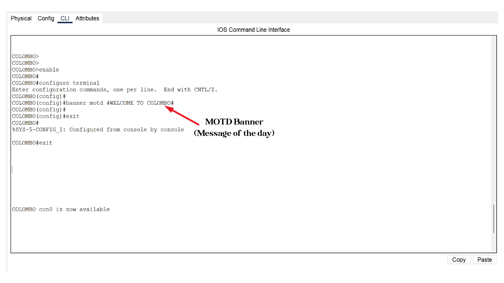

# **CCNA-Basic-Cisco-Configuration**
 

## In this task , I'm configuring basic Cisco configuration using  Cisco routers.(In this practical I'm using Cisco 1841 Routers)

### As the first step open the packet tracer and drag  2x Cisco 1841 routers to the screen and label them with your preference  (For now I'm labeling with **COLOMBO** and **KANDY**)

## Now I'm gonna split this task into below sections 

1. **Initial configuration { host name , MOTD banner (optional) }**
2. **Adjusting date and time**
3. **Assigning IP addresses with a description**
4. **Configuring  Passwords / Breaking Passwords / Recovering Passwords**

 

# 1. Initial Configuration
  

 ### Guess what?  Imagine we have a brand new / reset router to configure , then we have to do some essential configuration for over convenience .
 ### It's more important to configure ***host name*** for our convenience. Imagine we have to work with more than 2 routers , We are confusing ourselves when we  need to identify them each.
 ### As I mentioned we have already labeled our routers as “COLOMBO” and  “KANDY” respectively. 
 ### For host name configuration , I'm using following configuration commands on both routers.

 

### COLOMBO Labled Router                                                                                                                            

 	Router>
    Router>enable
    Router#
    Router#configure Terminal
        Enter configuration commands, one per line.  End with CNTL/Z. 
    Router(config)#
    Router(config)#
    Router(config)#hostname COLOMBO
    COLOMBO(config)#

### Try it yourself
    
    enable
    configure terminal
    hostname COLOMBO

### KANDY Labled Router                                                                                                                            

 	Router>
    Router>enable
    Router#
    Router#configure Terminal
        Enter configuration commands, one per line.  End with CNTL/Z. 
    Router(config)#
    Router(config)#
    Router(config)#hostname KANDY
    KANDY(config)#

### Try it yourself
    
    enable
    configure terminal
    hostname KANDY
 

## MOTD Banner
### MOTD (message of the day) banner is a message that used as a welcome message or used to aware someone about important things. 
### Imagine  in network admin hopes to resign and he want to aware the future network admin about configuration details (Branches ) 
### or any important messages (Authorization -who can access or who cannot) of ongoing routers. 

### Any of them ( I'm applying it on Colombo router )

 
    
    COLOMBO>enable
    COLOMBO#
    COLOMBO#configure terminal
    COLOMBO(config)#
    COLOMBO(config)#banner motd #WELCOME TO COLOMBO#
    COLOMBO(config)#

 

### Try with yourself

 

    enable
    configure terminal
    banner motd #WELCOME TO COLOMBO#

 

# 2. Adjusting Date & Time
### Eventhough date and time configuration ia an optional task  , that helps us in many occasions such as troubleshooting network device synchronizing accurate logging and much more.

### Any of them (I'm applying it on Colombo router)

    COLOMBO#clock set ?
     hh:mm:ss  Current Time
    COLOMBO#clock set 10:42:00 4 jul 2025

### Try it yourself & Check

    COLOMBO#clock set hh:mm:ss Day Month Year
    COLOMBO#show clock

# 3. Assigning Ip addresses

## Assigning IP addresses is one of the most important steps in the initial configuration of any network device. But why is it so important?

## Here’s the reason:

### Routing is one of the core concepts in networking. To understand routing and configure it properly, you must first understand what IP addresses are, 
### Why they are needed, and how they are assigned to interfaces. Without correct IP addressing, routing simply cannot work.
### Therefore, learning how to assign IP addresses is a crucial foundation before moving on to routing and more advanced network configurations.

# 4. Passwords (Configuring/ Breaking / Recovering)

# Configuration

## Im not trynna explain about why we need passwords. Lets just dig in to types of passwords.

1. **Console Password**
2. **Auxiliary Password**
3. **Telnet Password**
4. **Enable Password**
5. **Enable Secret**

 

# 1. Console and Auxiliary Password

### Both Console and Auxiliary passwords are used to secure direct access to the router through the console port or an auxiliary port. This prevents unauthorized people from physically connecting to the device or accessing it remotely over a dial line.

# 2. Telnet Password 
### Telnet passwords are used to secure remote access to the device via the Telnet protocol. When someone connects to the router or switch using Telnet, they’re prompted for this password before they can access the CLI.

# 3. Enable Password
### The Enable password protects privileged EXEC mode (also called enable mode). After logging in through the console, AUX, or Telnet/SSH, a user must enter the enable password to run higher-level configuration commands. 

# 4. Enable Secret
### The Enable Secret is a more secure version of the Enable password.  It also controls access to privileged EXEC mode but is stored in the configuration file in an encrypted form. If both the enable password and enable secret are set, the enable secret always takes priority.

# ⭐ Service password- Encryption  

    

   

